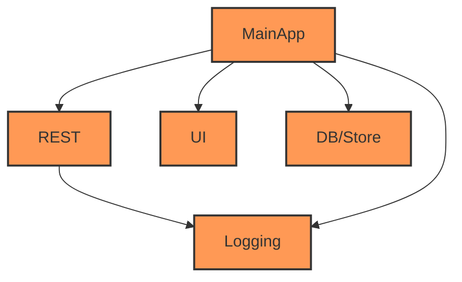

# Accedo tech test

Hi dear reader,
Thanks for the exciting challenge,
I've put around 22 hours on this project, if you don't count deep thinking in the shower about the structure =D
Hope you enjoy reading it as much as I enjoyed when writing it.

### This challenge will contain specific parts:
Rather than a monolithic application, I've decided to break parts into components,
These components have their own package.
(All these libraries are linked staticly to the main project)

1. REST (A light weight bundle that has been crafted for this code challenge from the groundup)
2. UI (A light weight bundle that contains `SwiftUI` and `NS.UIKit` custom views, I followed atomic design system)
3. DB/Store (A light weight bundle that contains interaction between main app and db/store inspired by this [article][cache-article-url]
4. Logging (Super simple logging logic)

### How to run:
There some steps to be able to run the application properly:
1. In order to use this service, you need an api key from themoviedb.
2. Put your api key inside your scheme environment variables, since this is an MVP, app will notify if you don't put them!
2.1. I've put it in scheme environment to prevent key being highjacked by some one.
2.2. This desicion has a lot of benefits which I can explain if needed :D

### Project pseudo: 
Project has 5 Main parts:

1. Bootstrap/main (Contains AccedoMain + AppDelegate + boot sequence configurations).
2. Modules (Genre, Movie)
I've tried to keep it super simple, and extracted reuseable parts.
2.1. Genre:
     This module contains both UIKit reprisentation and SwiftUI representation.
     UIKit representation module structer is VIPER, but SwiftUI version is MVVM + Wireframe.
2.2. Movie
     This module contains SwiftUI representation only.
     SwiftUI representation module structer is MVVM + Wireframe.
3. Network that includes Network related parts + proxies.
4. Database that includes storing objects and retrieving them + repositories.
5. Utils (Little extension over binding)
6. Resources (Not much =D)

## Dependency graph

## Features
1. There is no sharing secrets, since every developer has to create and config their own application.
2. Logging system is pretty good, although I tried to keep it super simple.
3. App supports multi language.
4. App supports light theme/dark theme.
5. You can stream app logs and download them after directly from the device.
6. I took it seriously, so code is really easy to read and to write tests for.
7. iPad and iPhone is supported and you can dynamically change layouts.
8. It has multiple separate flows.
9. BEST UI DESIGN in the world \\:D/

# Challenge desicions/information
- I've decided to not to add any prefetch logics, since the movie api was super simple, contained only primitive data (String, Bool, etc...)
- On the assignment was said to use lastest Swift version, but I've intertwined some parts with lower Swift version to flex >:D
- I've tried to create a scalable project, so in some parts I ignored the MVP purpose.
- I decided to not use any exta navigation/coordination logic.
- And for the sake of 22 hours, I certainly did not chose to use any development methodology like TDD or DDD, you didn't expecting some one to do for a test, did you? :D

## TODO:
1. Improve UI.
2. Create UML diagram.
3. Add tests to the main application.
4. Add hands-off functionality.
5. Expand app functionalities.

## License

MIT.

## Screenshots

### iPad

### iPhone

# Info

- [Github][github-url]
- [Linkedin][linkedin-url]

   [github-url]: <https://www.github.com/sajacl>
   [linkedin-url]: <https://www.linkedin.com/in/sajacl/>
   [cache-article-url]: <https://www.swiftbysundell.com/articles/caching-in-swift>
